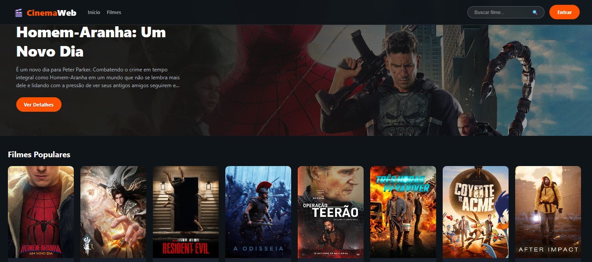
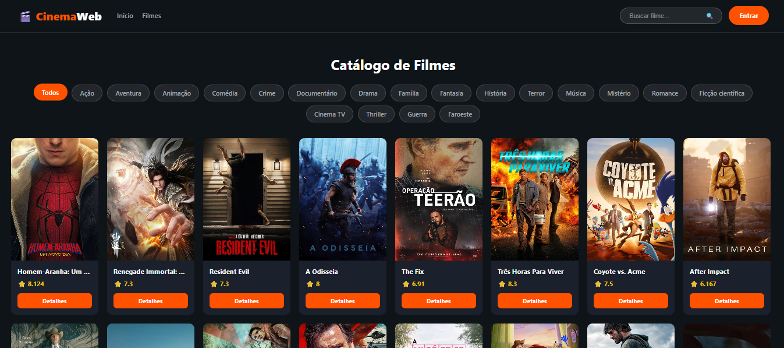
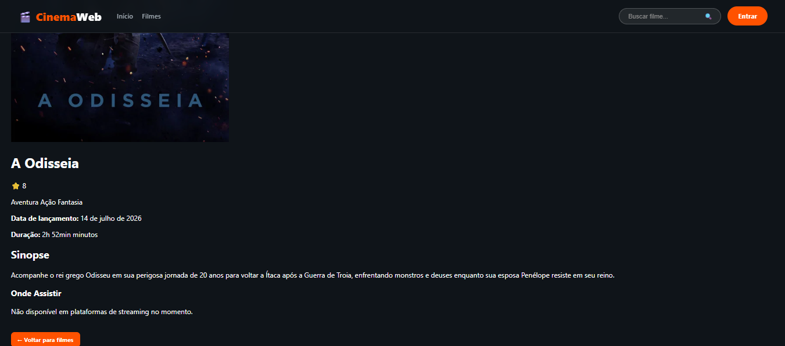
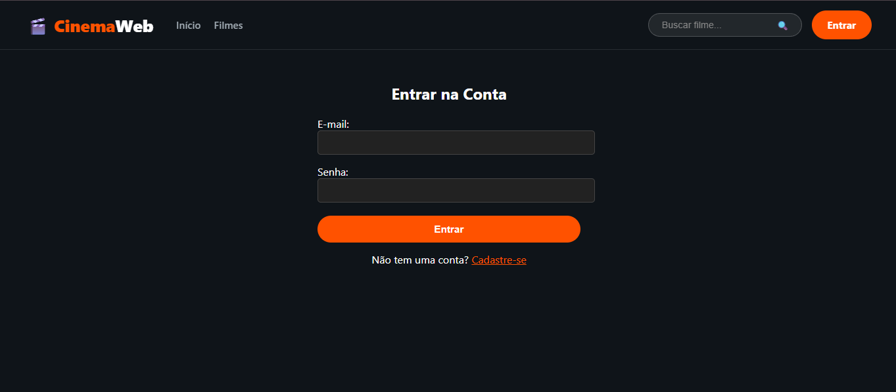
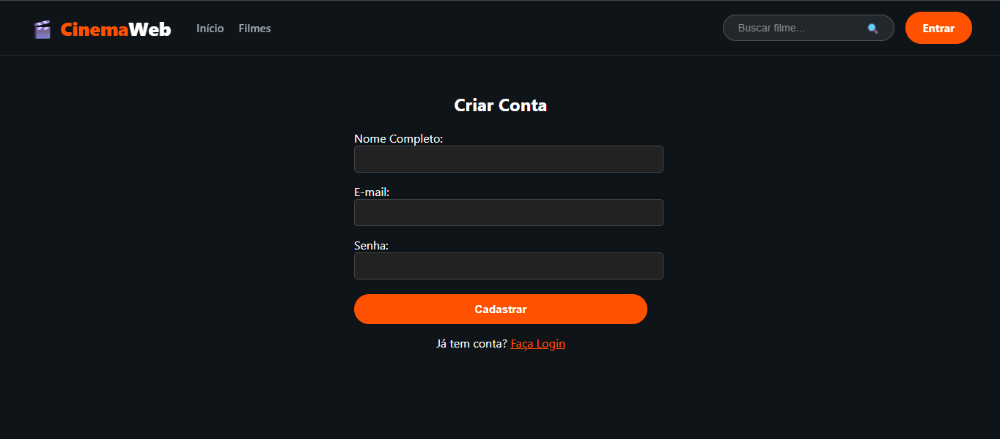

# 🎬 CinemaWeb

Aplicação web para descoberta e consulta de filmes, desenvolvida com **Node.js e Express** e integrada à API do **TMDB**.

O CinemaWeb permite pesquisar filmes, filtrar por gênero, consultar informações detalhadas e verificar onde os títulos estão disponíveis para assistir. A aplicação também possui sistema de autenticação, gerenciamento de perfis e área administrativa.

---

## Demonstração

### Página inicial


### Catálogo de filmes


### Detalhes do filme


### Login e cadastro



---

## Funcionalidades

### Filmes

- Listagem de filmes populares
- Busca de filmes por nome
- Filtro de filmes por gênero
- Página de detalhes dos filmes
- Informações sobre:
  - título
  - sinopse
  - data de lançamento
  - duração
  - gêneros
  - avaliação
- Consulta de onde assistir, alugar ou comprar

### Usuários

- Cadastro de usuários
- Login e logout
- Autenticação por sessão
- Criptografia de senhas com `bcrypt`
- Visualização do perfil
- Edição de nome e e-mail
- Exclusão da conta

### Administração

- Controle de acesso por nível de usuário
- Área administrativa protegida
- Listagem de usuários
- Exclusão de usuários
- Definição de permissões administrativas

---

## Tecnologias utilizadas

### Back-end

- **Node.js**
- **Express**
- **Sequelize**
- **SQLite**
- **bcrypt**
- **express-session**

### Front-end

- **HTML5**
- **CSS3**
- **JavaScript**
- **Handlebars**

### Integrações

- **TMDB API**

### Ferramentas

- **Git**
- **GitHub**
- **VS Code**

## Instalação

### Pré-requisitos
- Node.js e npm instalados
- Chave de API do TMDB

### Baixar o projeto e instalar as dependências

```bash
git clone https://github.com/SofiaSilva2008/CinemaWeb.git
cd CinemaWeb
npm install
```

## Configuração

Crie um arquivo `.env` a partir do modelo:

```bash
cp .env.example .env
```

Abra o `.env` e preencha as variáveis com seus próprios valores:

```env
PORT=3000
TMDB_API_KEY=sua_chave_da_api_tmdb
SESSION_SECRET=um_segredo_aleatorio_longo
ADMIN_EMAILS=admin@exemplo.com
```

Para obter uma chave da API, crie uma conta no [TMDB](https://www.themoviedb.org/ ) e solicite uma chave nas configurações de desenvolvedor.

`ADMIN_EMAILS` aceita e-mails separados por vírgula. Se não for usar essa configuração, deixe o valor vazio.

## Banco de dados

O projeto usa SQLite. Ao iniciar, o Sequelize sincroniza os modelos e cria ou utiliza o arquivo `database.sqlite` na pasta do projeto. Esse arquivo é local e está excluído do Git pelo `.gitignore`.

## Como iniciar

Depois de configurar o `.env`, execute:

```bash
npm start
```

A aplicação ficará disponível em `http://localhost:3000`, ou na porta definida pela variável `PORT`.
